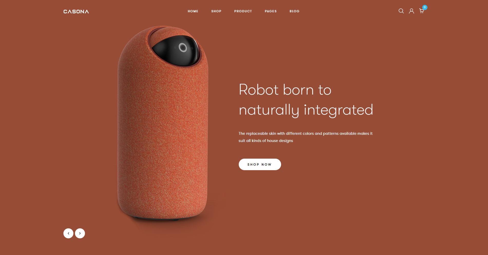

# E-commerce Website🛍️

E-commerce website for DevEducation's final project


## Authors

- [Anrsgrl](https://github.com/Anrsgrl)
- [Sakhinamammadzade](https://www.github.com/Sakhinamammadzade)
- [gunellst](https://www.github.com/gunellst)
- [mnargiz](https://www.github.com/mnargiz)
- [Negodyaj](https://www.github.com/Negodyaj)


## Screenshots




## Tech Stack

**Client:**

- **React:** Used for creating the user interface.
- **TypeScript:** Employed for type safety.
- **Redux toolkit:** Utilized for state management.
- **SASS/SCSS:** Used for styling.
- **Bootstrap:** Styling and layout of components.
- **Framer-motion:** Integrated for animations.

**Server:**

- **NestJS:** Managing server-side logic and creating APIs.

**Template:** 
- [Link to template](https://casona.familab.net/?header_style=header_1)


## Run Locally

Clone the project

```bash
  git clone https://github.com/Anrsgrl/eCommerce-website
```

Go to the project directory

```bash
  cd eCommerce-website
```

Install dependencies

```bash
  npm install
```

Start the server

```bash
  npm run start
```

